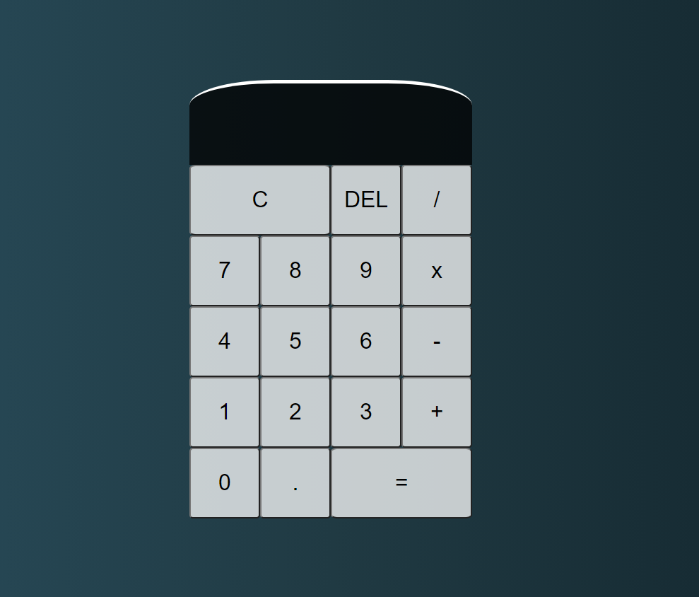

# Project Name
> Calculator App

## Table of contents
* [General info](#general-info)
* [Screenshots](#screenshots)
* [Technologies](#technologies)
* [Setup](#setup)
* [Features](#features)
* [Status](#status)
* [Contact](#contact)

## General info
The purpose of this App is to make simple calculations. 
My motivation for doing it was to practice my JavaScript knowledge and coding skills.

## Screenshots

## Technologies
* JavaScript

## Setup
All you need is to clone the repo.

## Features
List of features ready and TODOs for future development
* Basic Calculations

To-do list:
* To Become more complex in future
* Integrating it to React 

## Status
Project is: _finished_, for now

## Contact
Created by [@Dan](https://www.linkedin.com/in/danail-kostov-ba95b81b3/) - feel free to contact me!
 